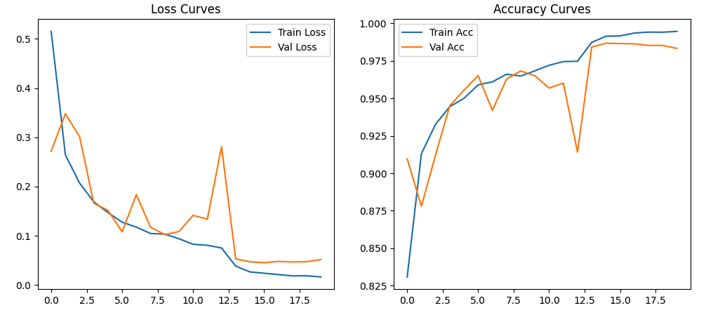
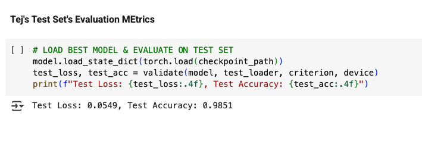

# AI-Land-Cover-Classification
AI based Earth's Land Use and Cover Detection + Classification using CNNs &amp; Satellite Imagery

Note: This is not the main project folder. This is just a representation of what theproject looked like, this project was developed in a private repo in my University's GitLab


## Table of Contents

- [Overview](#overview)  
- [Key Features](#key-features)  
- [How It Works](#how-it-works)  
- [Results](#results)  
- [Screenshots](#screenshots)  
- [Changelog](#changelog)  
- [Installation & Usage](#installation--usage)  
- [Tech Stack](#tech-stack)  

---

## Overview

This project applies state-of-the-art Convolutional Neural Networks (CNNs) to classify land use and land cover types from Sentinel-2 multispectral satellite imagery (EuroSAT dataset). By fine-tuning a ResNet50 backbone adapted for 13-band input, we achieve **98.51%** test accuracy—automating environmental monitoring, urban planning, and agricultural analysis at scale.

---

## Key Features

- **Layman’s Highlight:**  
  I built a powerful AI pipeline that “looks” at multispectral satellite images and instantly tells you whether it’s forest, urban sprawl, water, or farmland. No more manual map labeling—just feed it EuroSAT data and watch it classify land cover with near-perfect accuracy.

- **End-to-End Jupyter Notebook Workflow:**  
  - Custom `DatasetForStats` and `ImageClassificationDataset` classes using GDAL  
  - Per-band mean/std computation and advanced data augmentations  
  - Stratified train/validation/test splits for robust evaluation  
  - Fine-tuned ResNet50 with adaptive learning-rate scheduling and early stopping  
  - Clear, reproducible code with fixed random seeds and CUDA/CPU fallbacks

- **Technologies & Tools:**  Python · PyTorch · torchvision · GDAL · NumPy · scikit-learn · gdown · Jupyter Notebook · Matplotlib · CUDA/cuDNN · DataLoader · ReduceLROnPlateau scheduler · Early stopping · RandomResizedCrop · Random flips

---

## How It Works

1. **Data Preparation & Stats**  
   - Download EuroSAT via `gdown` for reproducible dataset retrieval.  
   - Compute per-channel (all 13 Sentinel-2 bands) mean and standard deviation with a custom `DatasetForStats`.

2. **Dataset & Transforms**  
   - Custom `ImageClassificationDataset` reads multispectral images with GDAL and stacks bands into PyTorch tensors.  
   - Advanced augmentations: RandomResizedCrop, horizontal & vertical flips.

3. **Model Adaptation**  
   - Load pre-trained `ResNet50` from `torchvision`, modify the first convolution layer to accept 13-channel input.  
   - Replace final fully-connected layer to match EuroSAT’s 10 land-cover classes.

4. **Training & Validation**  
   - Stratified splits: 80% train, 10% validation, 10% test.  
   - Optimizer: Adam (lr=1e-4); Scheduler: ReduceLROnPlateau (patience=3)  
   - Early stopping after 5 epochs of no validation improvement; checkpoint best model.

5. **Evaluation & Visualization**  
   - Plot train/val loss and accuracy curves.  
   - Final test-set evaluation yields **Test Accuracy: 98.51%**, **Test Loss: 0.0549**.

---

## Results

- **Best Test Accuracy:** 98.51%  
- **Final Test Loss:** 0.0549  
- Robust classification across 10 distinct land-cover categories.

---

## Screenshots

### 1. Training Loss & Accuracy Curves

  
_Figure 1: Training vs. Validation Loss (left) and Accuracy (right) over 20 epochs._

### 2. Final Test-Set Evaluation

  
_Figure 2: Best model checkpoint loaded and evaluated on the held-out test set._

---

## Changelog

### 🚀 New: Multispectral Support & Testing
- **Efficient Download:** `gdown` script to fetch EuroSAT automatically.  
- **Custom Stats Class:** `DatasetForStats` for per-band mean/std (13 bands).  
- **Multispectral Dataset:** `ImageClassificationDataset` stacks 13 GDAL bands into tensors.  
- **Model Input Adaptation:** First conv layer updated from 3 → 13 channels.  
- **Test Accuracy:** Achieved **98.51%** on the EuroSAT test split.

### 🔧 Previous: CNN Stack Enhancements
- Fixed random seed for reproducibility (42).  
- Device‐agnostic code (CUDA/CPU detection).  
- Data path validation with early sanity checks.  
- Computed data-driven normalization stats vs. arbitrary values.  
- Enhanced augmentations (RandomResizedCrop, vertical flips, ColorJitter).  
- Stratified train/val/test splits with scikit-learn.  
- Modular `Subset`-based DataLoaders with adaptive `num_workers`.  
- Fine-tuned ResNet50 via PyTorch’s latest API; configurable layer freezing.  
- Optimizer: Adam + ReduceLROnPlateau; Early stopping & checkpointing.  
- Visualization of loss and accuracy curves for overfitting detection.

---

## Installation & Usage

1. **Clone the repo**  
   ```bash
   git clone https://github.com/your-username/landuse-cover-cnn.git
   cd landuse-cover-cnn
   ```

2. **Create & activate environment**  
   ```bash
   conda create -n landcover python=3.9
   conda activate landcover
   pip install -r requirements.txt
   ```

3. **Download EuroSAT dataset**  
   ```bash
   python scripts/download_eurosat.py
   ```

4. **Run the notebook**  
   Launch Jupyter:  
   ```bash
   jupyter lab
   ```  
   Open `notebooks/Land Use Cover Classification CW3.ipynb` and execute cells in order.

---

## Tech Stack

- **Languages:** Python  
- **Deep Learning:** PyTorch, torchvision, CUDA/cuDNN  
- **Data Handling:** GDAL, NumPy, scikit-learn  
- **Visualization:** Matplotlib, Jupyter Notebook  
- **Utilities:** gdown, OS, pathlib


